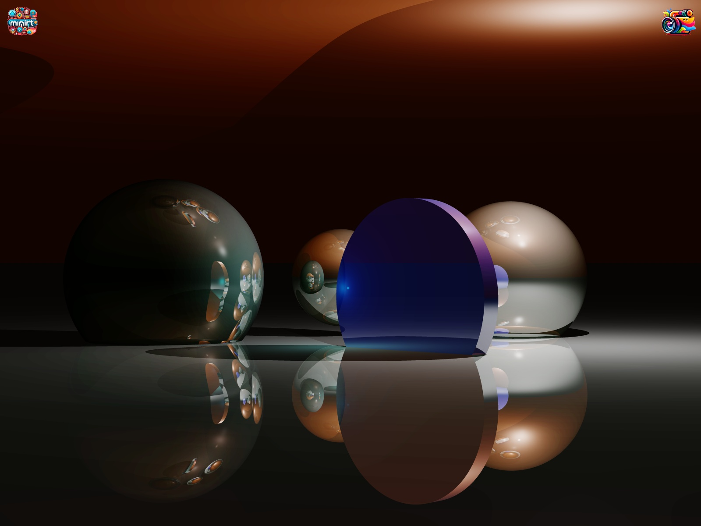
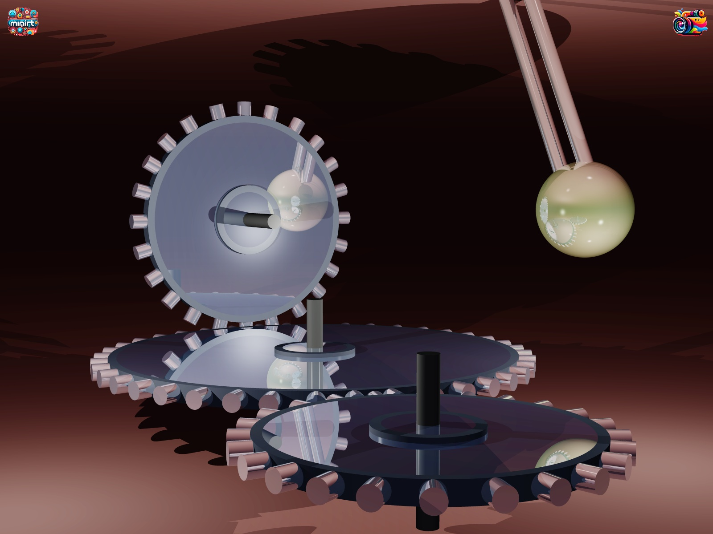
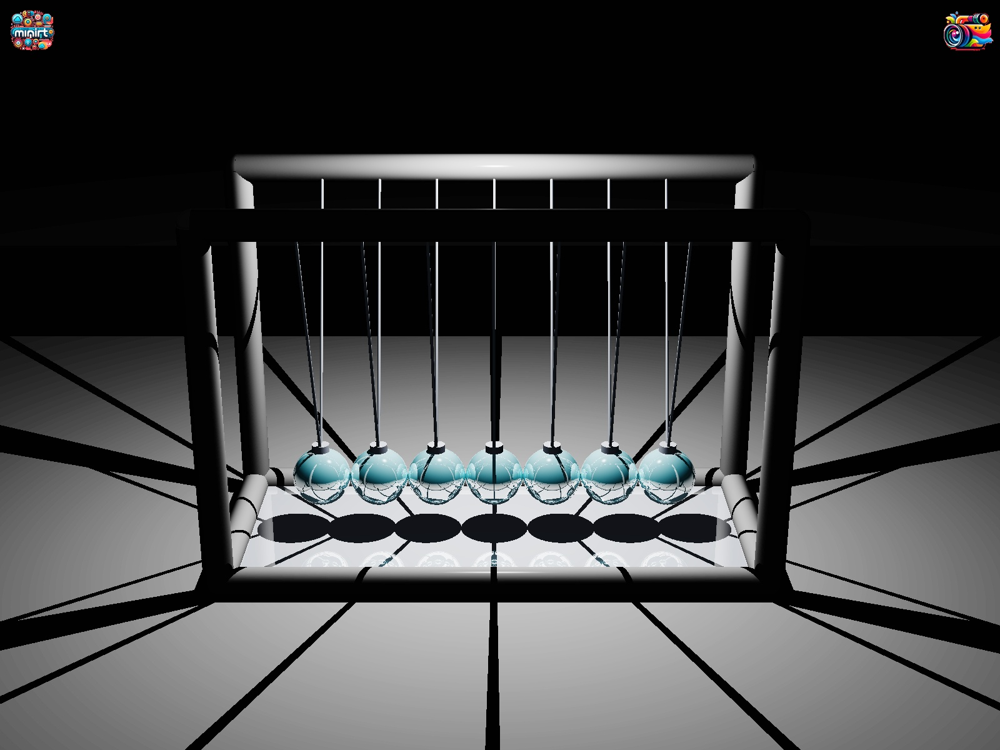

# Welcome to miniRT Project! 👋

miniRT is a small Ray Tracer project implemented as part of the curriculum at 42 School of Perpignan. 

## About miniRT

miniRT is a simple ray tracer written in C. It supports basic geometric primitives, various materials, and lighting effects. The goal of this project is to understand the fundamentals of ray tracing and computer graphics.

## Features

- Render basic geometric shapes (spheres, planes, squares, cylinders).
- Support for various materials (diffuse, specular, reflective).
- Implement basic lighting effects (ambient, point lights).
- Simple user interface for interacting with the scene.
- **Bonus Features:**
  - Advanced scene manipulation with object selection and movement.
  - Adjustable object dimensions.
  - Movable light sources with intensity adjustments (spot lights and ambient light).
  - A legend accessible by clicking on the "miniRT" symbol in the top left corner.
  - Current mode indicator (object mode / light mode / camera mode) in the top right corner.


## How to Use

To compile and run miniRT, follow these steps:

1. Clone the repository:
   ```bash
   git clone https://github.com/your-username/miniRT.git
   ```
2. Navigate to the project directory:
```bash
cd miniRT
```
3. Compile the program:
```bash
make
```
4. Run the program with a scene file:
```bash
./miniRT scene.rt
```
5. Explore the rendered scene!

## Scene File Format (.rt)
To create a valid .rt file for miniRT, follow this format:

**Ambient Light:**
```bash
A 0.2 255,255,255
```
- **A** specifies the ambient light.
- The first number is the intensity (range 0.0 to 1.0).
- The next three numbers represent the RGB color.

**Camera:**
```bash
C -50,0,20 0,0,0 70
```
- **C** specifies a camera.
- The first three numbers are the position (x,y,z).
- The next three numbers are the orientation (normalized vector).
- The last number is the field of view in degrees.

**Light:**
```bash
L -40,50,0 0.6 255,255,255
```
- **L** specifies a light source.
- The first three numbers are the position (x,y,z).
- The next number is the brightness (range 0.0 to 1.0).
- The last three numbers are the RGB color.

# Shapes:

**Sphere:**
```bash
sp 0,0,20 20 255,0,0
```
- **sp** specifies a sphere.
- The first three numbers are the position (x,y,z).
- The next number is the diameter.
- The last three numbers are the RGB color.

**Plane:**
```bash
pl 0,0,0 0,1,0 0,255,0
```
- **pl** specifies a plane.
- The first three numbers are a point on the plane (x,y,z).
- The next three numbers are the normal vector.
- The last three numbers are the RGB color.

**Cylinder:**
```bash
cy 50,0,20 0,0,1 14 50 255,255,0
```
- **cy** specifies a cylinder.
- The first three numbers are the base position (x,y,z).
- The next three numbers are the orientation vector.
- The next number is the diameter.
- The next number is the height.
- The last three numbers are the RGB color.

**Triangle** (bonus part):
```bash
tr -40,50,0 10,30,20 60,30,80 255,255,255
```
- **tr** specifies a triangle.
- The first three groups of three numbers are the vertices (x,y,z) of the triangle.
- The last three numbers are the RGB color.

> [!WARNING]
> For bonus section, ensure to include a value between 0 and 1 for the reflection coefficient. Here is an example of the correct formatting:

> [!NOTE]
> You can add the keyword "checkerboard" OR the path to a texture file at the end of the sphere definition for bonus special effects. To create a valid .rt file for miniRT, follow this format: `path_to_texture.xpm`, the path should point to a valid .xpm file.


## Adjustable Settings

Certain variables can be adjusted in the header file includes/z_main/se_mini_struct.h:
- **BUMP_SCALE**: Adjusts the intensity of bump mapping.
- **WIDTH** and **HEIGHT**: Sets the resolution of the rendered image.
These settings allow for fine-tuning of the rendering and effects in miniRT. Ensure to recompile (`make re`) the program after making any changes to these variables.

## Interface Guide

**Legend:** Access by clicking the "miniRT" symbol in the top left corner.
**Object Mode:** Select and move objects, modify their dimensions (use arrows and + / - key).
**Light Mode:** Move light sources and adjust their intensity (use arrows and + / - key).
**Camera Mode:** Adjust the camera position and view.
**Current Mode Indicator:** Displayed in the top right corner to show the active mode.

 ## Examples
Here are some example images rendered using miniRT:

<p align="center">

</p>

<p align="center">

</p>
<p align="center">

</p>
<p align="center">

</p>
<p align="center">

</p>

## Contributing
Contributions to miniRT are welcome! If you find any bugs or have suggestions for improvements, feel free to open an issue or submit a pull request.

## Contact
For questions or inquiries about miniRT, you can reach out to:<br>

Seb - [email](svidot@student.42perpignan.fr)<br>
Dan - [email](dsylvain@student.42perpignan.fr)<br><br>

Happy Ray Tracing! 🚀

